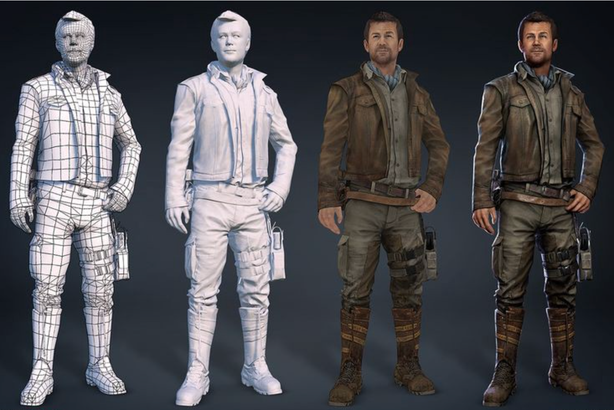
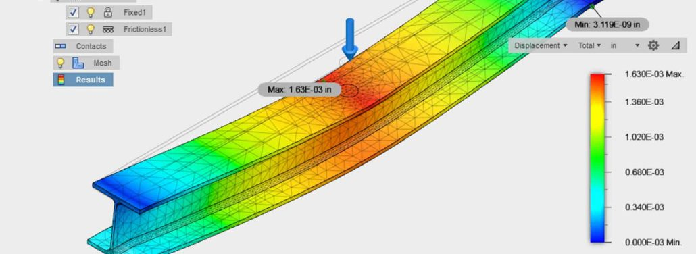

[toc]

# Introduction

In computer graphics and computational geometry, polygon mesh is used everywhere.

A polygon mesh, is a list of vertices, edges, and faces, serves as the foundational representation for 3D objects in digital world.

The manipulation and analysis of these meshes are essential for various applications spanning industries such as entertainment, engineering, medicine, and scientific research.

## **Visualization and Simulation**

 Polygon mesh processing facilitates the creation of 3D models in video games, movies, and virtual reality simulations. designers use tools like **Blender** to create and manipulate mesh structures, to create everything you see on the screen when you play a game.

## **Engineering and Manufacturing**

 In engineering and manufacturing, polygon mesh processing plays a crucial role in computer-aided design (CAD) and computer-aided manufacturing (CAM). Mesh manipulation enables engineers to simulate and analyze complex structures, optimize designs for functionality and efficiency, and prototype components with precision before physical production.

## **Medical Imaging and Analysis**

 Within the medical field, polygon mesh processing aids in the interpretation and analysis of medical imaging data. By converting medical scans into polygon meshes, physicians can visualize anatomical structures in three dimensions, aiding in diagnosis, treatment planning, and surgical simulations.

## **Scientific Research**

Mesh processing finds application in various scientific disciplines, including geology, biology, and physics. Researchers leverage mesh processing techniques to model geological formations, simulate fluid dynamics, study biological organisms, and analyze complex data sets, enabling breakthroughs in understanding natural phenomena and processes.

## **Virtual Reality and Augmented Reality**

With the rise of virtual reality (VR) and augmented reality (AR),  mesh processing has become instrumental in creating immersive digital experiences. By manipulating mesh geometry in real-time, developers can generate interactive virtual environments that respond dynamically to user inputs, enhancing the sense of presence and realism in VR and AR applications.

# Maths

Many fields of mathematics are used in this field, just to name a few linear algebra, geometry, geometric algebra, calculus, differential geometry and numerical analysis.

in this section i will try to cover some of the basic topics that we will need for the rest of the series, this will include basic geometry and linear algebra.

## Geometry

We can think of the mesh as 2 components, the topology and the geometry.

the topology is the connectivity information of the mesh, this can be described as an abstract graph.

geometry is the embedding of this graph in 2D or 3D space, we will assume 3D embedding for the rest of this series unless mentioned otherwise.

in 3D space we have points and vector, a point is 3 components (x,y,z) in R3 and a vector is used to represent a direction, vectors have 2 components a direction and a magnitude 

v = magnitude * direction, direction here is a unit vector (length = 1) and magnitude is the length of the vector v.

we can mix these 2 types to manipulate the geometry:
$$
point = point + vector.\\

vector = vector + vector.\\

vector = vector * scalar.\\

point * scalar \text{ //not defined mathematically}.\\

point + point \text{ //not defined mathematically}.\\
$$
some of the operation defined on a vector are:

- **Length**: the length of the vector is
  $$
  length((x,y,z)) = ||(x,y,z)||= \sqrt(x*x + y * y + z * z)
  $$
  e.g. the distance between 2 points a, b , 
  $$
  distance = length(b - a) = \sqrt((b_x-a_x)^2+(b_y - a_y)^2+(b_z-a_z)^2)
  $$

- **Dot product**: defined over 2 vectors, geometrically it's the projected length of vector a into vector b

$$
Dot(a, b) = a_x*b_x + a_y*b_y + a_z*b_z = ||a||*||b||*\cos(theta)
$$

 where theta is the angle between the 2 vectors.

- **Cross product**: defined over 2 vectors, geometrically it represent the area of the parallelogram defined by the 2 vectors in 3D space, also the direction of the result vector is parallel to both input vectors (this will become very useful later when dealing with triangles).
  $$
  a \times b = Cross(a, b) = ||a||*||b||*\sin(theta) = (a_y*b_z−a_z*b_y,a_z*b_x−a_x*b_z,a_x*b_y−a_y*b_x)
  $$

​	e.g. if we have a triangle in 3D represented as 3 points a, b and c and we want to compute the normal vector to this triangle we can do so by

defining 2 vectors u and v where u = b - a, v = c - a, normal = cross(u, v), length of the normal vector is double the area of the triangle and the direction is the normal vector to the plane defined by the triangle, almost all of the time we will need the normal vector to be **unit vector** i.e. length = 1, the operation to compute a unit vector out of any vector is called normalisation.

-  **Normalisation**: computing a unit vector from any vector
  $$
  uˆ = u / ||u||
  $$
  

## Linear Algebra

Here i will be just talking about linear transformations and how we can achieve them using matrices.

Matrix can be used as a linear function that transforms 1 space into another, this transformation has to be linear, i.e. in the form 
$$
y = a x + b
$$
so we can implement a scaling of list of points by creating a scaling matrix 
$$
m = \begin{bmatrix} scale_x,0,0\\\ 0,scale_y,0\\\ 0,0,scale_z \end{bmatrix}
$$
 then create a nx3 matrix **a** from the input points 
$$
b = m * a
$$
this is extremely powerful when dealing with large data because we can use the associative nature of vector matrix multiplication to combine a large number of operations (or mappings) into a single mapping 

lets consider the simple multiplication case first:
$$
y = a ( b (c (d (x))))\\
y = (a * b * c  * d) * x
$$
the same applies when dealing with matrices, now lets consider why this is both beautiful and very efficient.

assume that we have a mesh consisting of 1'000'000 points that we want to first rotate around x vector, scale then rotate around y vector, the naive implementation would require us to do first 1M matrix vector multiplication for the x rotation followed by another 1M for the scaling followed by another for the y rotation.

but since the operation is associative (but order dependent) we can just multiply the 3 matrices together to form 1 matrix and use this matrix to transform our points.

this is used **everywhere** in computer graphics.

some of you might have noticed that some of the transformation in 3D (like translation) can't be represented in a 3x3 matrix as a linear operation and you right, for this we use **homogenous coordinates**.

### Homogenous Coordinates

Mathematical intuition behind this isn't very straight forward but please check the reference list if you are interested, what this does in a nutshell is that we use 4D space to encode our 3D vectors and points, now our transformation is encoded as a 4x4 matrix.

 

 

 

# Datastructures

# Algorithms

## Subdivision

## Simplification

## Remeshing

## Boolean Operations

# What Next?

# References

- https://people.eecs.ku.edu/~jrmiller/Courses/VectorGeometry/VectorOperations.html
- https://www.youtube.com/watch?v=MOYiVLEnhrw 
- https://www.pmp-book.org/
- https://en.wikipedia.org/wiki/Homogeneous_coordinates
- https://en.wikipedia.org/wiki/Polygon_mesh
- https://www.cs.princeton.edu/courses/archive/fall22/cos426/lectures/Lecture-6.pdf